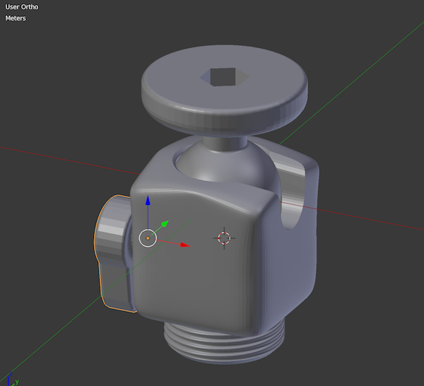

# Toolz

by Martin Fröhlich for [http://tecartlab.com](http://tecartlab.com)

## Fixations

### BallJoint

This 3d printable object is a redesign of a small Manfrotto BallJoint. It requires:

* 1 x hexheaded bolt screw with UNC 1/4" x 1 3/4" 
* 1 x screw nut with UNC 1/4"
* 1 x hexheaded bolt screw with M4 x 40
* 1 x screw nut with M4
* 1 x screw nut with M6
* 1 x screw nut with M8 (alternatively)

##Licence

 TurnTable of <a xmlns:cc="http://creativecommons.org/ns#" href="http://tecartlab.com">Martin Fröhlich</a> is licensed under <a rel="license" href="https://creativecommons.org/licenses/by-nc-sa/4.0/">CC BY-NC-SA 4.0
</a>. 